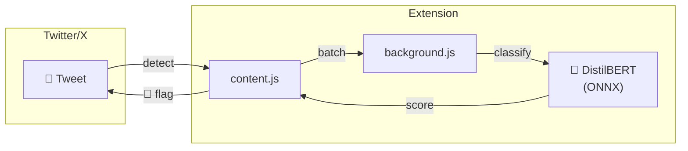

<div align="center">

# 🧠 Psychofauna

### **Ragebait detection that runs entirely in your browser.**

A Chrome extension that uses local ML to identify inflammatory content on Twitter/X—no data ever leaves your device.

[](https://github.com/alecsharpie/psychofauna)
[](https://github.com/alecsharpie/psychofauna)
[](LICENSE)

<br/>

[**Install**](#-quick-start) · [**How it Works**](#-how-it-works) · [**Roadmap**](#-roadmap)

<br/>


</div>

---

## 🎯 The Problem

Social media algorithms optimize for engagement, often surfacing inflammatory "ragebait" content that hijacks your attention and mood. **Psychofauna** helps you take back control.

## ✨ The Solution

| Feature | Description |
|---------|-------------|
| 🔒 **100% Local** | ML inference runs in-browser via WebAssembly. Zero API calls. |
| ⚡ **Real-time** | Classifies tweets as they load in your feed |
| 🎯 **Visual Cues** | Flagged content highlighted with red border |
| 🛡️ **Fallback** | Keyword heuristics if model fails to load |

---

## 🔧 How it Works



1. **Detect** — MutationObserver watches for new tweets
2. **Extract** — Text pulled from tweet elements  
3. **Batch** — Grouped for efficient inference
4. **Classify** — DistilBERT runs via [Transformers.js](https://huggingface.co/docs/transformers.js)
5. **Style** — Flagged tweets get visual treatment

---

## 🚀 Quick Start

```bash
# 1. Clone
git clone https://github.com/alecsharpie/psychofauna.git
cd psychofauna

# 2. Get Transformers.js
curl -o chrome-extension/libs/transformers.min.js \
  https://cdn.jsdelivr.net/npm/@xenova/transformers@2.17.1/dist/transformers.min.js

# 3. Fetch model
cd chrome-extension && sh scripts/fetch_hf_sst_model.sh
```

Then in Chrome:
1. Go to `chrome://extensions/`
2. Enable **Developer mode**
3. Click **Load unpacked** → select `chrome-extension/`
4. Visit Twitter/X ✨

---

## 📁 Structure

```
psychofauna/
├── chrome-extension/     # The browser extension
│   ├── content.js        # Tweet detection & UI
│   ├── background.js     # Service worker
│   ├── worker.js         # ML inference (Transformers.js)
│   ├── models/sst2/      # Bundled DistilBERT (ONNX, ~67MB)
│   └── ...
└── train/                # Model training scripts
    ├── train.py          # Fine-tuning pipeline
    └── onnx.py           # Export to ONNX
```

---

## 🗺️ Roadmap

- [x] MVP with sentiment classifier
- [x] Heuristic fallback
- [x] Debug mode overlays
- [ ] Custom ragebait-trained model
- [ ] User feedback loop
- [ ] More platforms (Reddit, etc.)
- [ ] WebGPU acceleration

---

## 🛠️ Tech

| Layer | Stack |
|-------|-------|
| ML Runtime | [Transformers.js](https://huggingface.co/docs/transformers.js) + ONNX WebAssembly |
| Model | DistilBERT (quantized) |
| Extension | Chrome Manifest V3, Offscreen API |
| Training | PyTorch + 🤗 Transformers |

---

## 🤝 Contributing

PRs welcome! Especially for:
- Custom training data (labeled ragebait examples)
- Performance optimizations
- Additional platform support

---

<div align="center">

**MIT © [Alec Sharp](https://github.com/alecsharpie)**

*Take back your feed.*

</div>
